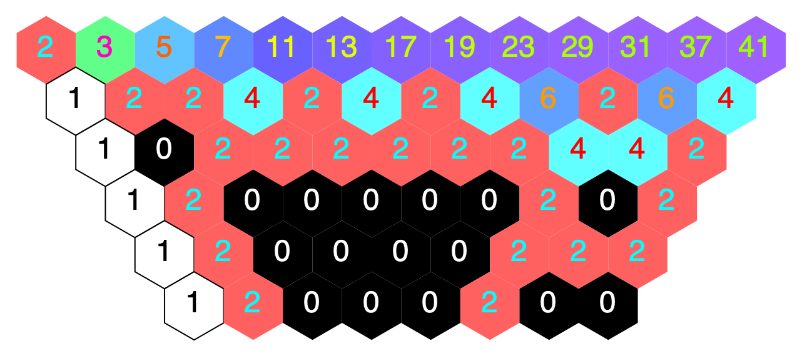
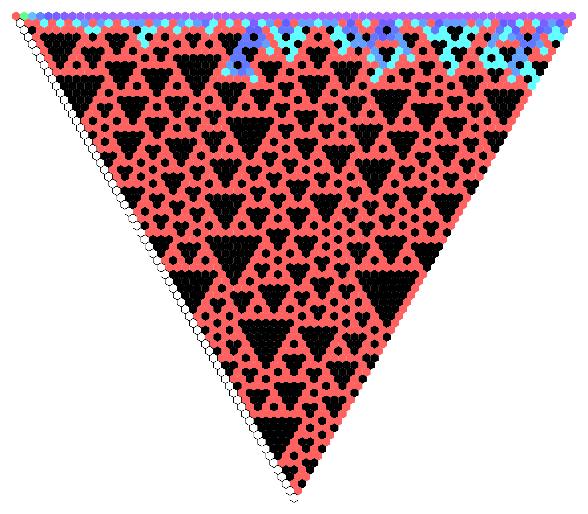
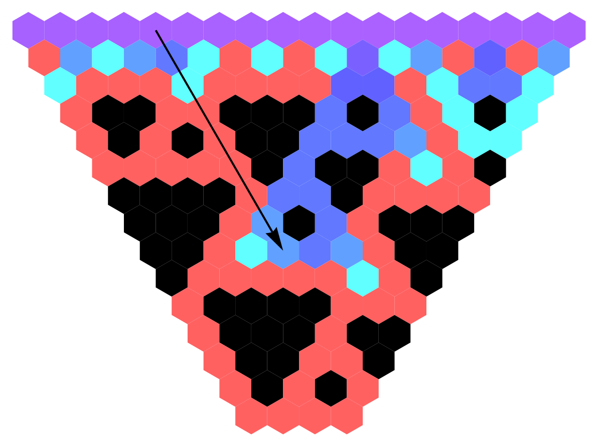
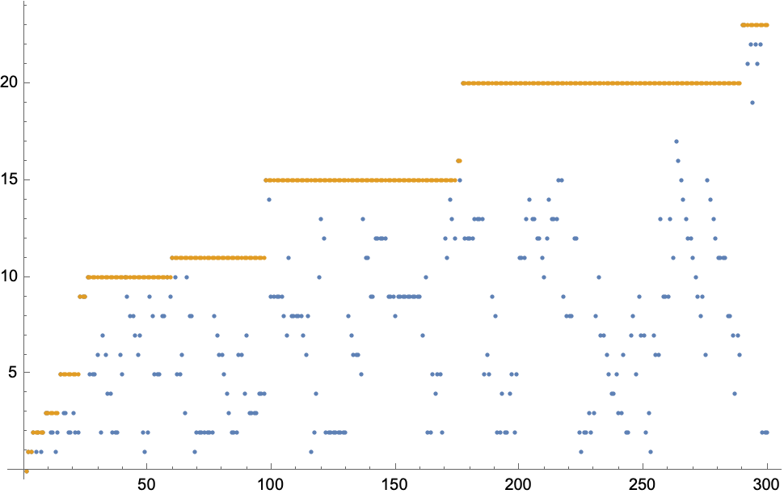
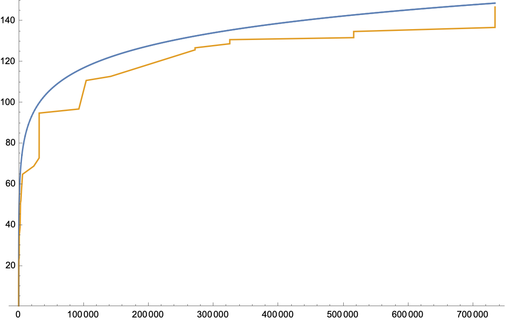

This is a notebook for visualizing the components of [Gilbreath's conjecture](https://en.wikipedia.org/wiki/Gilbreath%27s_conjecture).

Gilbreath's conjecture states that the following observed pattern is actually a rule:

*If you consider the sequence of prime numbers, and take the absolute difference between every consecutive term, and then the absolute difference between every consecutive term in the newly generated sequence, and so on, then each sequence thus generated will begin with a 1.*

It's easier (for me) to think about the statement visually, which is why I wrote this notebook. In the following image, the top row is the sequence of prime numbers, and each number is the absolute difference of the two numbers to the upper left and right of it.

Since we only start with a finite subsequence of the primes in this image, the right hand side ends rather unnaturally. But we can go further:

We stick to the same color scheme—everything that's black is zero, and everything that's red is two. 

Notice that once we have a row of all zeros or twos (started by a one), we know that the triangle generated underneath that row will satisfy Gilbreath's conjecture (i.e., the left side will be all 1's). This is because the set ${0,2}$ is closed under absolute difference, and the absolute difference of both $0$ and $2$ with $1$ is $1$. So, the bulk of the row stays of the same form (zeros and twos), and the 1 on the left edge propagates downward. We could have been satisfied we had checked Gilbreath's conjecture for the first so-many primes in the following image at row 12.

Sometimes it's easier to prove a harder problem than an easier one, because the harder one gives you more information to work with than it gives you obstacles to overcome. Sometimes.

One such harder problem would be establishing a bound on the "height" of nontrivial structures as measured in the direction of the arrow in the image below. ("Nontrivial" meaning made of hexagons that are not 0 or 2.)

Notice how the arrow enters some 0-2 territory, then has to cross a nontrivial structure that emerged from further up.

If Gilbreath's conjecture is false, then there's some monstrous structure that emerges from very large successive primes and reaches all the way to the left until it hits our line of 1's. We don't know if it is false or not, so all we can talk about for now is the *apparent height*—that is, the height as measured in a given evolution triangle.

If we plot the apparent height at each point, we get the following. Sequence index is on the *x*-axis, and apparent height on the *y*-axis. The maximum apparent height encountered thus far is drawn in yellow-orange.

Let's look at that yellow-orange line and see what happens if we extend it a bit further. It seems to level off quite rapidly. Here it is apparently bounded by some power of a logarithm (eyeballed for demonstration purposes).

Proving a bound like this would be much stronger than proving Gilbreath's conjecture (which only says that the height at 3 is 0).

That's about where my experimentation ended here. I really only wanted to visualize it initially, but couldn't help computing some quantities. I'll probably return to this eventually and start playing around with it again...
