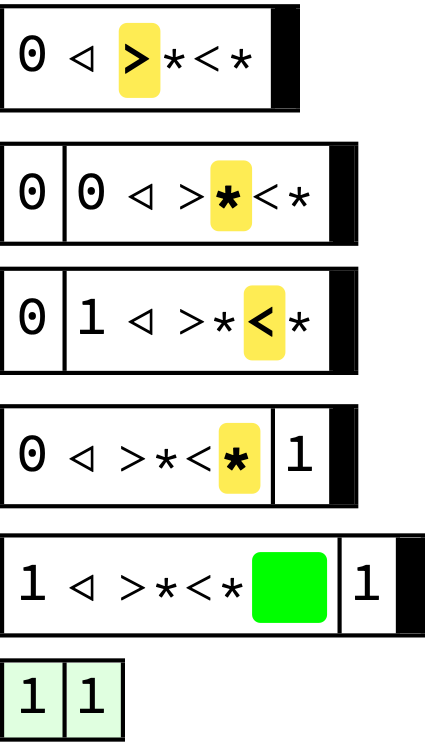
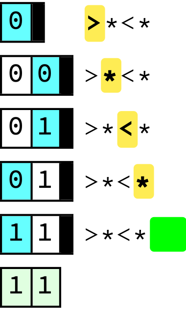
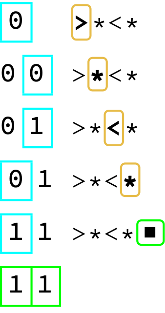
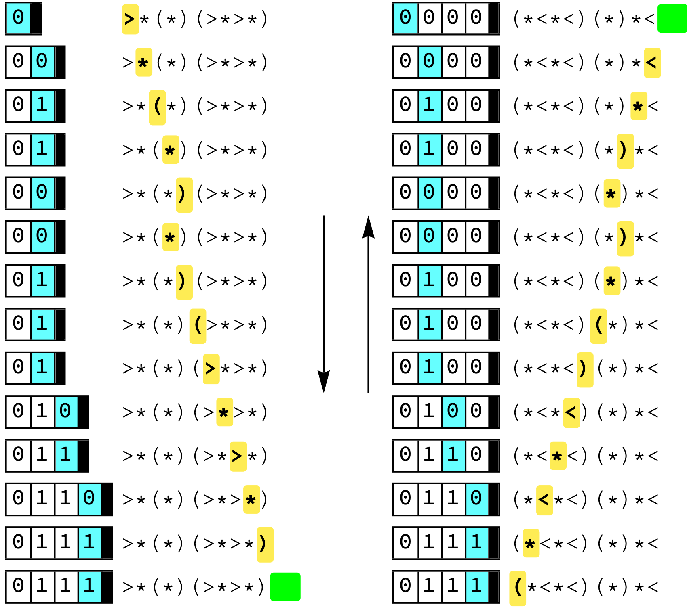
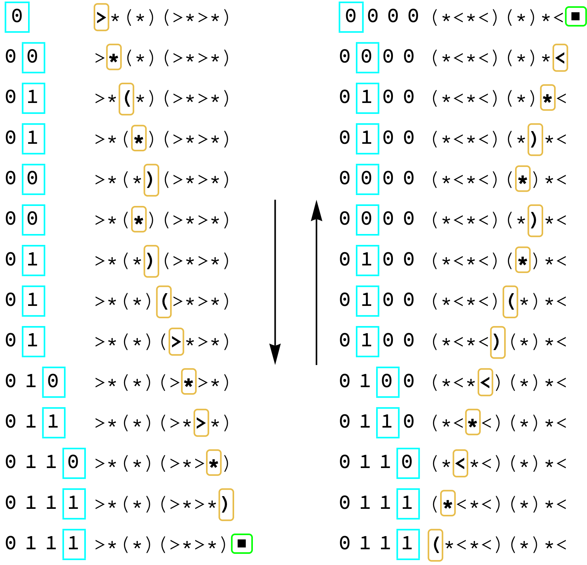

[Reversible bitfuck](https://esolangs.org/wiki/Reversible_Bitfuck) is an even more esoteric programming language than the esolang [Brainfuck](https://en.wikipedia.org/wiki/Brainfuck). It's esoteric enough that it's simply credited to user Orby of the esolangs wiki, and I thought it would be fun to visualize it in action.

## Background

An RBF machine consists of a right-inifinite tape which holds a 1 or 0 at each spot (0 initially), a tape head, a string defining the program, and an instruction pointer. An RBF program has 5 commands:

| Syntax      | Semantics   |
| ----------- | ----------- |
| `*`   | Toggle the bit at the tape head.     |
| `<`   | Shift the tape head left. |
| `>`   | Shift the tape head right. |
| `(`, `)`   | If the tape head reads a 0, move the instruction pointer to the character following the matching parenthesis. (Otherwise, no-op and keep reading.) |

The instruction pointer begins at the first character of the program and moves one character to the right after reading and executing each command (unless otherwise specified). If we attempt to read out-of-bounds—i.e. we reach the end of the program string, we cannot find a matching parenthesis, or there is no character after a matched parenthesis—the program halts.

As you'd expect, this is Turing-complete, otherwise it wouldn't be of much interest!

## Representation

We have a few simple datatypes. `Tape` holds a sequence of 0's and 1's as arguments. The program is represented as a list of characters. The instruction pointer is represented by wrapping the pointed-to character in `At`. The program (and instruction pointer) are attached to a certain 0 or 1 via `LeftTriangle` (which renders nicely). The tape is right-infinite, so we append 0's to `Tape` as necessary via the computation rules.

Here's a basic formatted view generated by the notebook:

Each line is an evaluation step. The highlighted character is executed and its effect is seen in the following tape state.

But having the code visually *at* the position of the tape head is a bit busy. So we can separate it out:

We also have a "delicate" style that's a little less bold. (Still working out how to get Mathematica to align things properly, though.

### *Reversible* bitfuck?

That's the cool thing about reversible bitfuck: if a given program $p$ is run on an initial tape state of $t_0$ and halts leaving the tape (and tape head) in state $t_1$, then there is a program $p^*$ which, when run on $t_1$, will halt and leave the tape in state $t_0$.

It's an inverse in a very strong sense: the steps in the evaluation history of $p$ are in correspondence with the steps of $p^*$.

We compute $p^*$ by simply reversing the program string and flipping the direction of each directed operator (namely, `<` is exchanged with `>`, and `(` is exchanged with `)`).

Here's a demonstration of the reversibility in action. We run $p=$`>*(*)(>*>*)` top-to bottom on the left, and run $p^*=$`(*<*<)(*)*<` bottom-to-top on the right. Notice that the tape is in the same state on both sides, and the instruction pointer hovers over the corresponding character in the inverse program.

Oh, and here's a more delicate version.

