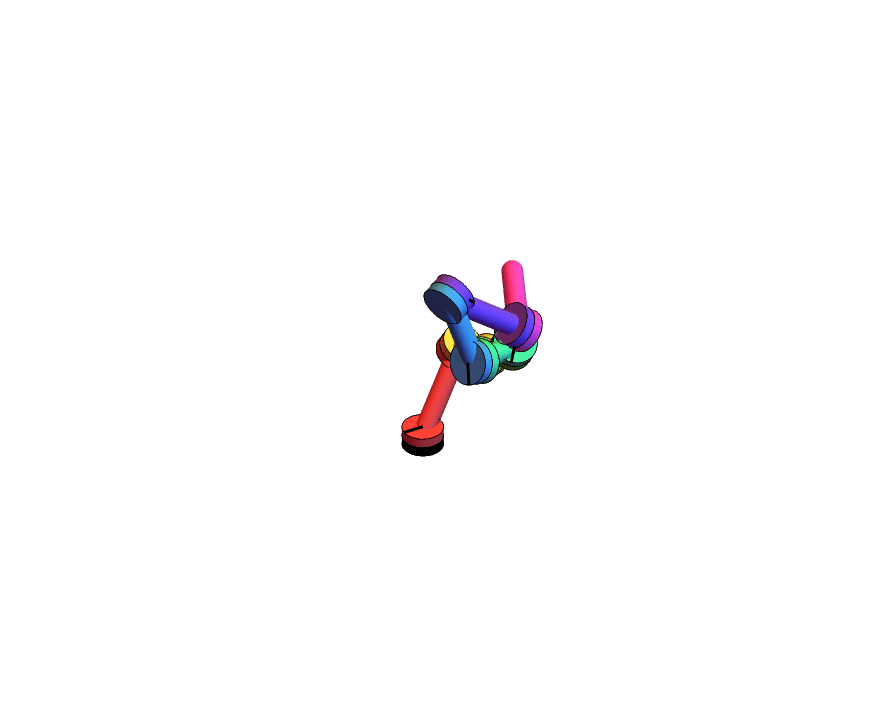
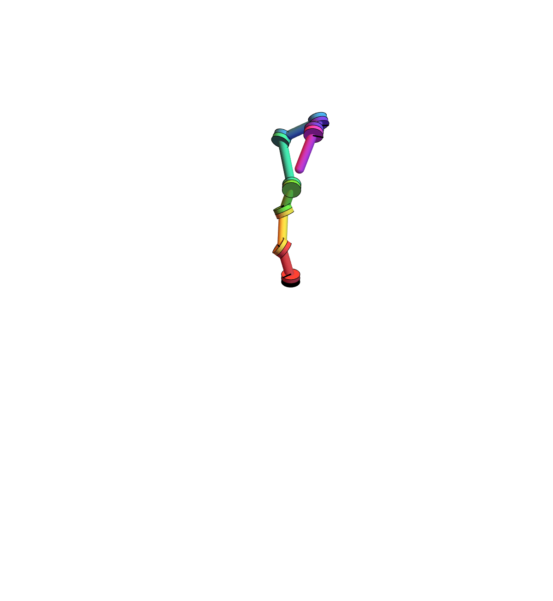
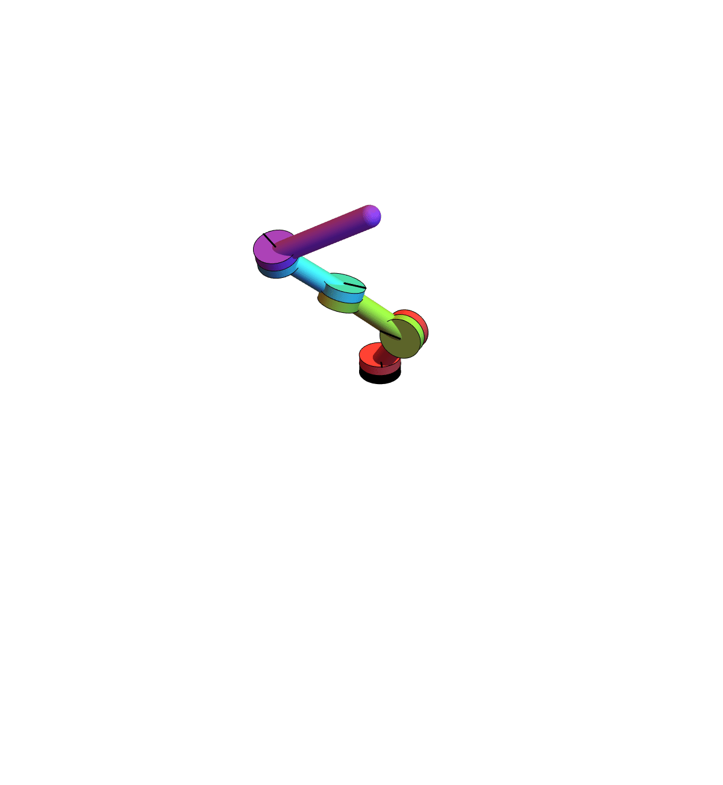

This is a notebook from a midterm project for a robotics class I audited in university. The task was to simulate a robotic arm in a programming language of our choice.

The interesting part here has to do with how we 1) parameterize the robot itself 2) construct the coordinate systems at each joint and translate between them.

## Robot Parameters

For (1), we use the following variables.

* $\theta$ describes the degree the "joint plane" is rotated back from the perpendicular towards the incoming arm segment.

* $\phi$ describes the rotation around the incoming joint which we bend the rotation plane back along.

* $L_\theta$ describes the angle through which the robot arm is bent down vertically towards the joint plane.

* $q$ is a dynamic parameter describing the current rotation of the joint.

(In later code, we have a parameter $\psi$ which describes the azimuthal angle around the joint that the outgoing arm segment is bent down towards, but we ignore that here as it's nearly redundant with $q$.)

https://user-images.githubusercontent.com/68410468/223592563-572372f9-ff4b-44c6-9d6b-a446e66ecf81.mp4

Note that we can achieve an "elbow joint" by taking $L_\theta = \pi/2$ and $\theta = \pi/2$, and a "shoulder joint" by taking $L_\theta = \pi/2$ and $\theta = 0$.

https://user-images.githubusercontent.com/68410468/223592737-6cd2a0fa-4413-4e6a-8cfc-899b7dc50cbb.mp4

## Coordinate systems

We need coordinate systems at each joint which are well-suited to the properties of that joint.

We construct Cartesian coordinate systems (here meaning such that the standard inner product on the coordinates induces the Euclidean metric. Given a coordinate system based at one of the joints, and given a vector in that coordinate system (representing the arm segment), we want to compute a(n affine) coordinate transformation to a coordiante system based at the end of that arm. Further, we want the segment to lie on the negative $z$-axis of the new coordinate system, which means choosing a standard way to "tilt" the new coordinate system. This "tilt" is canonical whenever the segment length is positive (which it must be).

In the below, the sliders correspond to the components of the vector defining the segment.

https://user-images.githubusercontent.com/68410468/223624417-db4d5bd4-2d4b-4b7a-ba84-b39667cf6155.mp4

Here it is iterated.

https://user-images.githubusercontent.com/68410468/223624627-8fd6ce98-6461-4fdc-817d-98200ae5c414.mp4

## Putting it together

Now that we know how to design a robot and construct coordinate systems to talk about it in, we can put it together and get an interactive visualization of a robot arm.

https://user-images.githubusercontent.com/68410468/223624829-0f0dd410-0d71-403e-8164-6eb5ebd01ffc.mp4

This lets us change the number of segments and randomize the parameters.

https://user-images.githubusercontent.com/68410468/223624906-09c71abf-e141-42e8-9de2-4a7496ddf247.mp4

https://user-images.githubusercontent.com/68410468/223624911-e9c64258-99fe-44b6-b40a-b6131ba2d4f9.mp4

We can also adjust the parameters manually in a different view.

https://user-images.githubusercontent.com/68410468/223624956-9ea0eb26-42b9-41bf-a287-7e6a92c97145.mp4

And we can also export gifs like the one at the top of the page!

